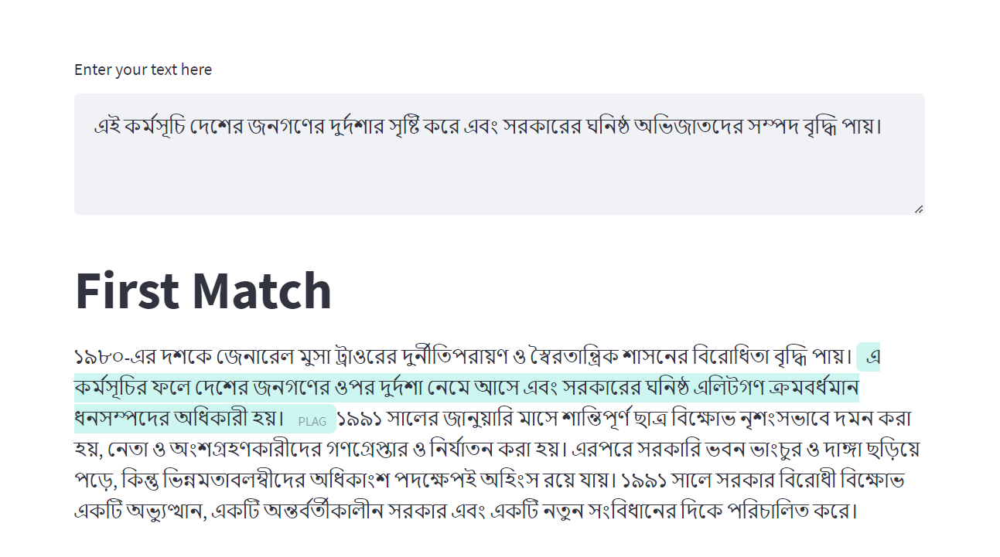

# Bangla Plagiarism Dataset and Detection: A Benchmark

Term Project for ***CSE 472: Machine Learning Sessional*** offered by the Department of CSE, BUET.



## Project Overview
This work presents a comprehensive exploration into the domain of plagiarism detection in Bangla language documents, with a focus on the development of a deep learning-based system for accurate identification and quantification of instances of plagiarism. The primary objective of this research is to establish a benchmark for Bangla plagiarism detection by creating a dedicated dataset that encompasses various types of plagiarism.

To achieve this goal, we generated a synthetic dataset featuring instances of two common plagiarism types: Word Replacement Plagiarism and Paraphrase Plagiarism. The dataset is designed to represent real-world challenges in detecting subtle manipulations in Bangla text, providing a robust foundation for evaluating plagiarism detection systems.

In the implementation phase, we developed a sophisticated deep learning-based system capable of discerning multiple forms of plagiarism in Bangla documents. The system was trained and evaluated on the synthetic dataset, demonstrating proficiency in identifying instances of plagiarism with varying degrees of obfuscation. The plagiarism types considered include Copy and Paste (No Obfuscation), Paraphrasing, and Word Replacement.

The experimental results highlight the system's effectiveness in accurately detecting and categorizing instances of plagiarism in Bangla text. The proposed benchmark dataset and detection system contribute to the advancement of research in Bangla plagiarism detection, providing a valuable resource for evaluating the performance of future systems and fostering the development of robust solutions in the field.

## Dataset

Available at ***Hugging Face*** 🤗 datasets   [bangla-plagiarism-dataset](https://huggingface.co/datasets/zarif98sjs/bangla-plagiarism-dataset)

```bibtex
@misc{zarif-bn-plag:2023,
  title={Bangla plagiarism dataset},
  author={Alam, Md. Zarif Ul and Alam, Ramisa and Mahmood, Md. Tareq},
  year={2023},
  publisher={Hugging Face},
  journal={Hugging Face Datasets},
  howpublished={\url{https://huggingface.co/datasets/zarif98sjs/bangla-plagiarism-dataset}},
}
```